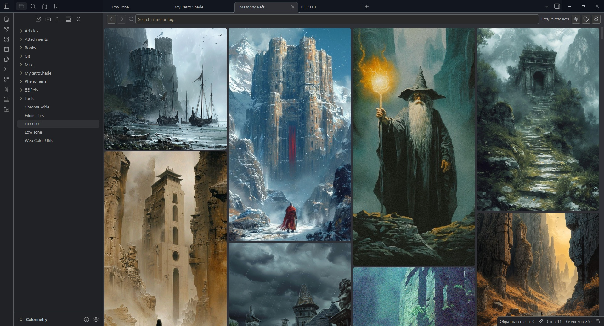
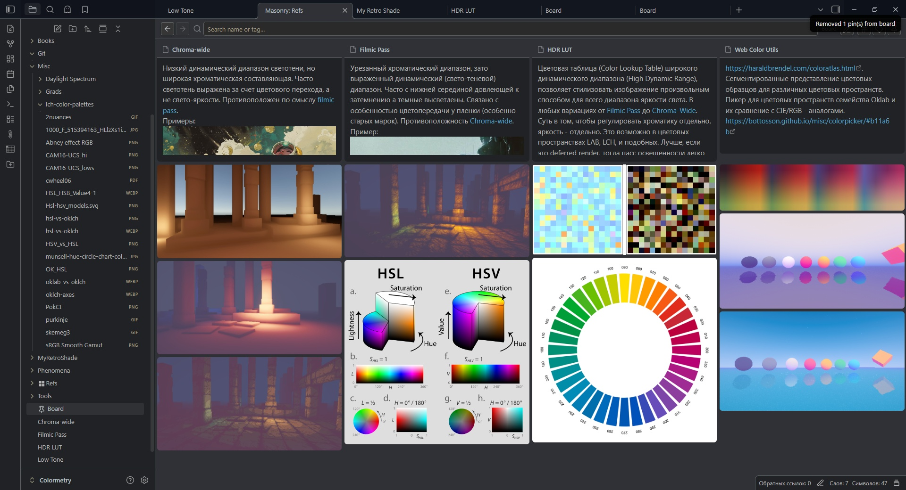
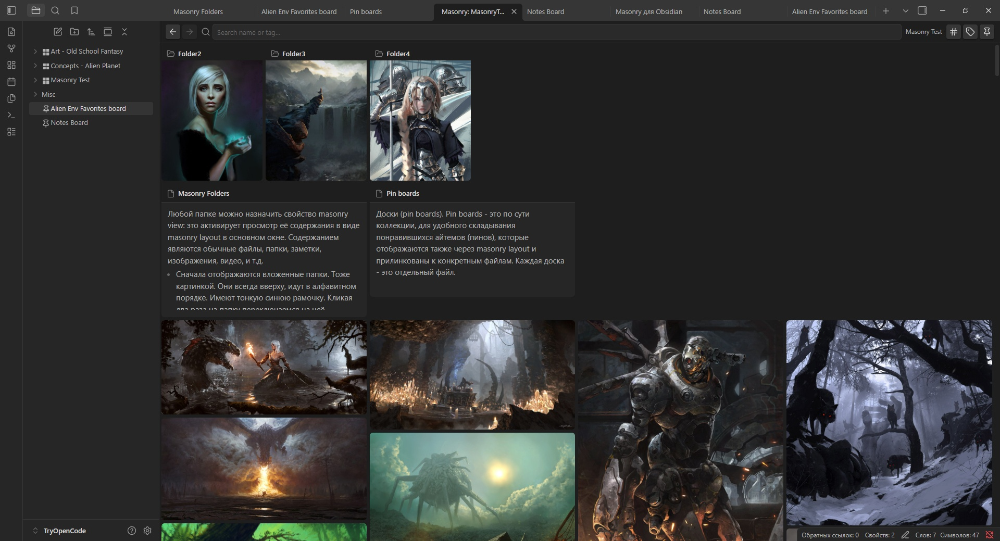
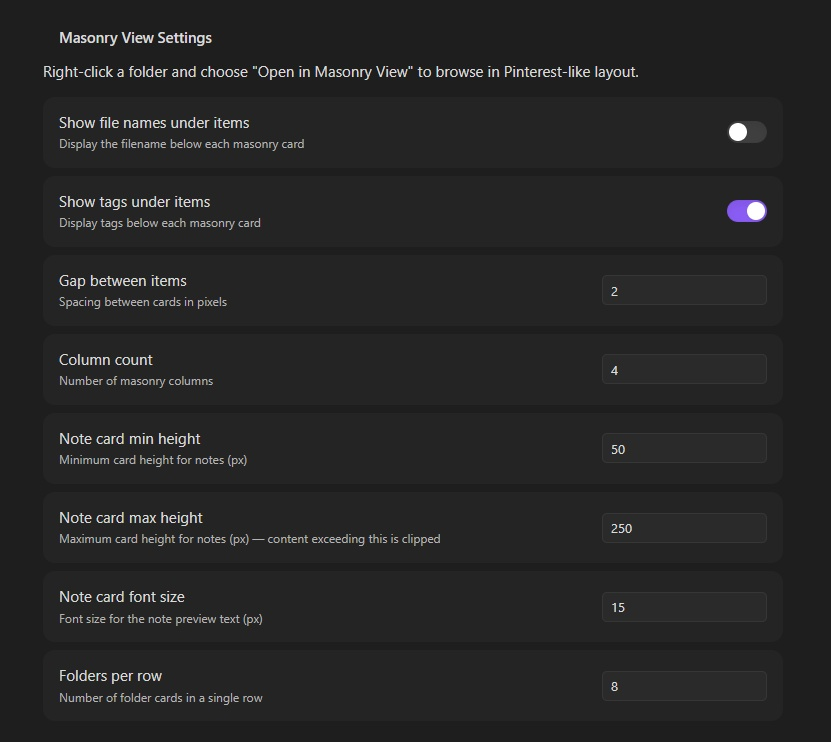

# Obsidian Masonry

An Obsidian plugin that displays folder contents in a Pinterest-like masonry layout with tag management, pin boards, and drag-and-drop.

  

## Usage

- You can use folders to view it's content as masonry tiles (call them items). You work with actual files it this case.
- You can create a pin boards and pin any files to it, and view as masonry tiles (call them pins). You work with only a record in collection, not files itself.
- You can add tags to items/pins.
- To turn folder in to a masonry layout right-click on a folder → **Enable Masonry View**. You will see a tile icon appear next to the folder name (call them a masonry folder).
- Click on a masonry folder label to view it's content, click on foldout triangle to open/close folder. Double click on label also work as foldout.
- Right-click in files explorer → **Create Pin Board** to make a board
- Drag notes, images, or other files onto a pin board (to pin), or a masonry folder (to move)
- Use Ctrl + Click to select several items in masonry view
- Add tags to items/pins if you wish
- Use the search bar to filter by name or tag (`#tagname`)
- Double-click on images to preview it
- Right-click on items/pins for context menus and quick actions
- Settings: use plugin settings to customize

---
  

  
  
  

